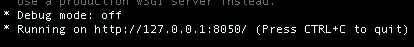

# Cryptocurrency Performance using Bollinger Trading Strategy

This repository contains code for a Plotly Dash app exploring prices and performance of a Bollinger trading strategy for major cryptocurrencies. It also includes notebooks that show how I scraped data for information related to major cryptocurrencies, how to get news about the cryptocurrency market, and how to use pandas to get daily financial data.

## What is a Bollinger trading strategy?

The Bollinger trading strategy specifes whether to buy or sell an asset based on Bollinger Bands. Bollinger Bands are the upper and lower thresholds at which you choose to sell or buy an asset, respectively. The bands are calculated as follows:
1. Select a window size of `N` periods in the past
2. Using this window, calculate a moving average (MA) and moving standard deviation (SD)
3. Select a standard deviation control `K`
4. Construct the upper band (MA + K\*SD) and lower band (MA - K\*SD)

The Bollinger trading strategy says to buy an asset when the price falls below the lower bollinger band, and to sell an asset when the price is above the upper band. In this app, the typical values of N=20 and K=2 are used. 

## Demo


## Requirements
The Dash app was created in Python 3.6.

Install the dependencies by using `pip install -r requirements.txt`

## Usage

To run the app use the command
```
$ python app.py
```

and copy the URL given in the command line as seen in the image below and paste it into your browser.


